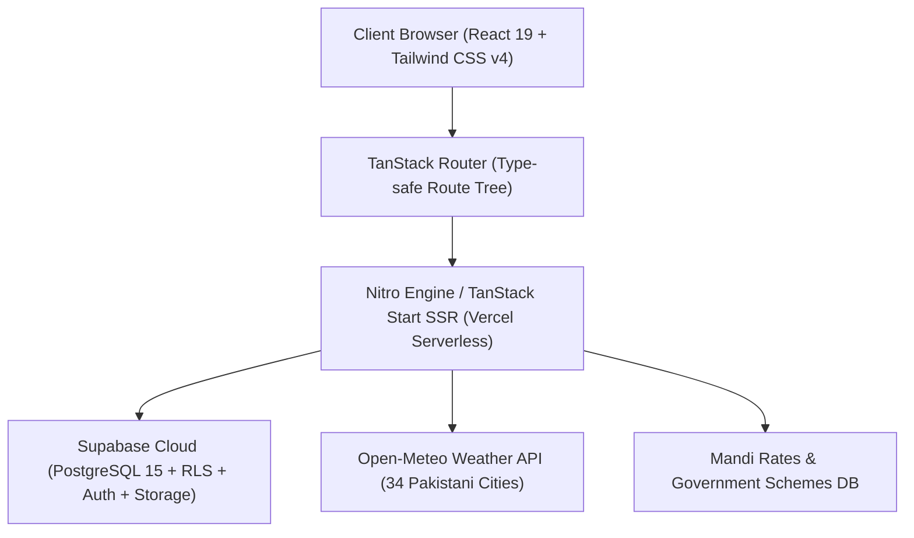

# 🌾 AgriBusiness.pk — Pakistan's Premier Agri-Tech & B2B Trade Ecosystem

> **AgriBusiness** is an enterprise-grade digital agriculture platform, B2B trading floor, clinical advisory suite, and professional verified network engineered specifically for Pakistan's agricultural ecosystem — connecting **Farmers & Producers**, **Commodity Buyers & Millers**, **Agronomists & Veterinary Consultants**, **Agribusiness Enterprises**, and **Students & Researchers**.

[](https://vercel.com)
[](https://react.dev)
[](https://tanstack.com)
[](https://supabase.com)
[](https://tailwindcss.com)
[](https://www.typescriptlang.org)
[](https://nitro.unjs.io)

---

## 🧭 Companion Apps Suite & Route Directory

The platform provides dedicated workbench tools, clinical diagnostics, and marketplace engines accessible across 5 agricultural personas:

| Portal / Companion App | Route | Target Audience & Purpose |
|---|---|---|
| 📰 **Network Feed** | `/feed` | Professional network activity feed: crop updates, diagnostic inquiries, commercial offers, and harvest milestones with role-aware composers and Mandi snapshot. |
| 🏦 **Government Schemes Directory** | `/resources` | Province-filtered repository of Pakistani agricultural support programs (Punjab Kisan Card, ZTBL, SBP Credit, Crop Insurance, Land Records, Extension Advisory) with official links. |
| 🏪 **Agri-Biz Trading Floor** | `/apps/agri-biz` & `/marketplace` | B2B classifieds and marketplace for crops, livestock, seed lots, machinery, fertilizers, and farm inputs across all Pakistani mandis. |
| 🌿 **Plant Clinic** | `/apps/plant-clinic` | Crop health diagnostics, pest identification, symptom analysis, and direct consultations with certified agronomists. |
| 🐄 **Animal Clinic** | `/apps/animal-clinic` | Telehealth for dairy and livestock farmers with prescriptions from veterinary specialists (DVM) and researchers. |
| 📋 **Projects & RFP Marketplace** | `/projects` | Live agricultural tenders, farm needs, corporate contract requirements, and consultant proposal bidding. |
| 🔍 **Universal Search & Network** | `/search` | Directory of verified agricultural professionals, enterprises, produce lots, and service providers across 34 cities. |
| 💼 **Member Workbench** | `/dashboard` | Role-tailored operating dashboard featuring Farm Intelligence, Sourcing Desk, Lead Radar, Bookmarks, and Matchmaking. |
| 📊 **Mandi Rates Desk** | `/rates` | Real-time and historical commodity price tracking across Pakistan's agricultural markets. |
| 🛡️ **Super Admin Portal** | `/admin-login` & `/admin` | Platform moderation, member verification badges, ad review, real-time telemetry, and audit trail. |

---

## 🏗️ Architecture & Technology Stack



### Technology Matrix

| Layer | Technology | Details |
|---|---|---|
| **Frontend Framework** | React 19.2 + TypeScript | Next-generation reactive UI with modern hooks and transitions |
| **Meta-Framework** | TanStack Start (SSR) | Server-Side Rendering with type-safe server functions |
| **Routing** | TanStack Router 1.170 | File-based, zero-runtime error route tree with automatic code splitting |
| **Styling & Design System** | Tailwind CSS v4 + Custom "Field Ledger" | Harvest-inspired palette: Evergreen (`#0F5132`), Harvest Gold (`#E6B00F`), Rice Canvas (`#F4F2E9`) |
| **Typography** | Fraunces + Inter + Noto Nastaliq Urdu | Editorial almanac serif headers, modern sans UI body, native Urdu typography |
| **Database & Security** | Supabase (PostgreSQL 15) | Multi-tenant isolation with 12 RLS policies, custom ENUMs, and GIN Trigram indexes |
| **Server Runtime** | Nitro 3.0 (Vercel Preset) | Ultra-lightweight SSR serverless handler generating `.vercel/output` |
| **Data Fetching & Cache** | TanStack Query v5 | Optimized server state synchronization and client cache management |

---

## 👥 5-Role Access Architecture & Permission Matrix

AgriBusiness implements an authentic 5-Role Role-Based Access Control (RBAC) model with dedicated workbench tooling for each persona, plus a Super Admin governance layer:

| Feature / Capability | 🚜 Farmer (`farmer`) | 🏢 Buyer / Miller (`buyer`) | 🔬 Consultant / Vet (`consultant`) | 🏭 Enterprise (`company`) | 🎓 Student (`student`) | 🛡️ Super Admin (`admin`) |
|---|:---:|:---:|:---:|:---:|:---:|:---:|
| **Farm Profile & Crop Acreage** | ✅ Full CRUD | ❌ | ❌ | ❌ | ❌ | ✅ View |
| **Commodity Procurement Desk** | ❌ | ✅ Full CRUD | ❌ | ❌ | ❌ | ✅ View |
| **Consulting Credentials & Rates** | ❌ | ❌ | ✅ Full CRUD | ❌ | ❌ | ✅ View |
| **Company Registration & Staff** | ❌ | ❌ | ❌ | ✅ Full CRUD | ❌ | ✅ View |
| **Academic & Research Portfolio** | ❌ | ❌ | ❌ | ❌ | ✅ Full CRUD | ✅ View |
| **Publish Produce / Input Listings** | ✅ Produce | ❌ | ✅ Advisory | ✅ Products / Inputs | ❌ | ✅ Moderate |
| **Publish RFPs & Farm Needs** | ✅ Farm Needs | ✅ Sourcing RFP | ❌ | ✅ Enterprise RFP | ❌ | ✅ Moderate |
| **Submit Technical Proposals** | ❌ | ❌ | ✅ Full Bidding | ❌ | ❌ | ✅ Moderate |
| **Clinical Diagnostic Cases** | ✅ Report Case | ❌ | ✅ Solutions | ❌ | ❌ | ✅ Moderate |
| **Consented Connection Inbox** | ✅ Full | ✅ Full | ✅ Full | ✅ Full | ✅ Full | ✅ Audit |
| **Member Verification Badges** | ❌ | ❌ | ❌ | ❌ | ❌ | ✅ Full RPC |
| **Audit Logs & Telemetry** | ❌ | ❌ | ❌ | ❌ | ❌ | ✅ Full |

---

## 🔒 Privacy & Consented Contact Card Architecture

Direct contact details (Phone number, WhatsApp, Email, CNIC) are **never publicly exposed** in directory searches or profile URLs:
1. **Public View (`directory_profiles`):** Exposes only safe attributes: `display_name`, `user_type`, `city`, `province`, `is_verified`, and public bio.
2. **Private Storage (`profile_private`):** Encrypted contact fields isolated behind strict Row Level Security (RLS).
3. **Consented Contact Exchange:** Members exchange a formal Connection Request (`connection_requests`). Only upon **mutual acceptance** does the PostgreSQL RPC `get_accepted_connection_contact(peer_id)` return the contact methods that the member has explicitly opted to share.

---

## 🌾 Pakistan Agricultural Intelligence Engine

The platform integrates custom localized agricultural intelligence:
- **12-Crop Pakistan Calendar:** Seasonality, sowing windows, harvest periods, and regional belts for Wheat, Basmati Rice, Cotton, Sugarcane, Maize, Potato, Tomato, Onion, Kinnow, Mango, Chickpea, and Canola.
- **Open-Meteo Weather Integration:** Real-time 4-day weather forecasts and temperature tracking mapped to 34 Pakistani agricultural hubs without requiring third-party API keys.
- **Derived Advisory Generator:** Automated weather-aware field recommendations (spray warnings during rain, heat mitigation for livestock, irrigation scheduling during dry spells).
- **Mandi Live Rates Feed:** Real-time modal prices tracked across Punjab, Sindh, KPK, and Balochistan grain and produce markets.

---

## 🔑 Pre-Configured Demo Accounts

All demo accounts use the standard password: **`DemoAgri2026!`**

| Persona | Email | City | Role Capabilities |
|---|---|---|---|
| 🚜 **Farmer** | `ali.hassan.farmer@agribiz.demo` | Multan | Farm profile, crop calendar, weather advisory, produce listings |
| 🏢 **Buyer** | `tariq.foods.buyer@agribiz.demo` | Lahore | Sourcing desk, procurement RFPs, commodity matching |
| 🔬 **Consultant** | `dr.ayesha.agro@agribiz.demo` | Faisalabad | Lead radar, agronomy credentials, proposal bidding, clinic solutions |
| 🏭 **Enterprise** | `admin.greentech@agribiz.demo` | Karachi | Machinery & input catalog, corporate RFPs, commercial engagements |
| 🎓 **Student** | `zara.student@agribiz.demo` | Faisalabad | Academic portfolio, opportunity radar, thesis fieldwork search |

---

## 🚀 Production Deployment Guide (Vercel)

AgriBusiness is fully pre-configured for automated deployment to **Vercel** with Nitro Build Output API v3.

### 1. Push to Git Repository
```bash
git add .
git commit -m "feat: production deployment ready"
git push origin main
```

### 2. Import into Vercel
1. Go to the [Vercel Dashboard](https://vercel.com/new).
2. Click **"Add New..."** → **"Project"** and import your Git repository.
3. Framework Preset: Leave as **Other** (configured by `vercel.json` and Nitro).
4. Build Command: `npm run build` (configured automatically).
5. Output Directory: `.vercel/output` (handled automatically).

### 3. Configure Environment Variables in Vercel
Under **Project Settings** → **Environment Variables**, configure the following:

| Variable Name | Required | Description | Example Value |
|---|:---:|---|---|
| `VITE_SUPABASE_URL` | **Yes** | Supabase Project URL | `https://your-project.supabase.co` |
| `VITE_SUPABASE_ANON_KEY` | **Yes** | Supabase Public Anon Key | `eyJhbGciOi...` |
| `SUPABASE_URL` | Optional | Server-side Supabase URL | `https://your-project.supabase.co` |
| `SUPABASE_SERVICE_ROLE_KEY` | Optional | Supabase Service Role Key | `eyJhbGciOi...` |
| `CRON_SECRET` | Optional | Security token for cron triggers | `hex32_random_token` |
| `OPENAI_API_KEY` | Optional | For vector embeddings | `sk-proj-...` |

### 4. Deploy
Click **Deploy**. Vercel will build the SSR bundle and deploy globally with edge static caching and serverless SSR routes.

---

## 🗄️ Database Setup & Migrations

### One-Click Complete Database Initialization
To set up or refresh your Supabase database from scratch:
1. Open your [Supabase Project Dashboard](https://supabase.com/dashboard).
2. Navigate to the **SQL Editor**.
3. Open [`supabase/COMPLETE_DATABASE_SETUP.sql`](supabase/COMPLETE_DATABASE_SETUP.sql), paste the entire script, and click **Run**.
4. *(Optional Demo Data)*: Run [`supabase/DEMO_SEED_DATA.sql`](supabase/DEMO_SEED_DATA.sql) to populate demo profiles, market rates, categories, and marketplace listings.

### Sequential Migration Files (`supabase/migrations/`)
For incremental migration pipelines:
- `00_extensions.sql` — PostgreSQL extensions (`uuid-ossp`, `pgcrypto`, `citext`, `pg_trgm`)
- `01_enums.sql` — Domain enums (`user_type`, `subscription_status`, `listing_status`, `project_status`, etc.)
- `02_core_schema.sql` — Core tables (`profiles`, `profile_private`, `categories`, `listings`, `projects`, `messages`, `ads`)
- `03_indexes.sql` — Performance B-Tree and GIN Trigram indexes
- `04_triggers.sql` — Automated user creation triggers and timestamp sync
- `05_rls_policies.sql` — Multi-tenant Row Level Security policies
- `06_storage_buckets.sql` — Supabase Storage buckets for avatars and media
- `07_functions.sql` — Ad rotation, trial expiry, and notification helpers
- `08_seed_categories.sql` — Baseline 24 official agricultural sectors
- `09_role_dashboard_security.sql` — Role tables, connection requests, and directory view
- `10_production_governance.sql` — Super Admin RPC functions and audit logging
- `11_five_role_connections.sql` — Buyer desk, consented contact exchange RPC, and constraint hardening

---

## 💻 Local Development & Quality Assurance

### 1. Prerequisites
- **Node.js**: `v20.x` or `v22.x` / `v24.x` (LTS recommended)
- **npm**, **pnpm**, or **bun**

### 2. Setup & Install
```bash
# Clone the repository
git clone https://github.com/jawadaipy/agribusiness_final.git
cd agribusiness_final

# Install dependencies
npm install
```

### 3. Environment Configuration
Copy `.env.example` to `.env` and supply your Supabase credentials:
```bash
cp .env.example .env
```

### 4. Available NPM Scripts
```bash
# Start local development server (http://localhost:8080)
npm run dev

# Full production build (Nitro + Vercel SSR output)
npm run build

# Preview production build locally
npm run preview

# TypeScript static type check (0 errors)
npx tsc --noEmit

# Run ESLint across source code
npm run lint

# Run end-to-end web route & SSR suite
npm run test:routes

# Verify live database tables and connectivity
npm run test:db
```

---

## 🏷️ Official 24 Agricultural Industry Disciplines

1. Agricultural Engineering and Technology
2. Agribusiness Family Care
3. Agriculture & Field Crops
4. Basic Sciences
5. Business Management Sciences
6. Computer Science & AI
7. Construction & Infrastructure
8. Education & Extension
9. Electronic and Print Media
10. Engineering (Civil, Mechanical, Electrical)
11. Food Science and Technology
12. Health and Diagnostics
13. Horticultural Sciences & Orchards
14. Information Technology
15. Lab Equipment and Chemicals
16. Law and Agri-Lawyers
17. Marketing & General Order Supplies
18. Oilseed Industry
19. Poultry Science / Animal Husbandry
20. Real-Estate & Farm Land
21. Sugar Industry & Cane Technology
22. Textile & Cotton Technology
23. Veterinary Science (DVM)
24. Other Specialized Disciplines

---

## 📄 License & Governance

Engineered for **AgriBusiness Pakistan**. All rights reserved.